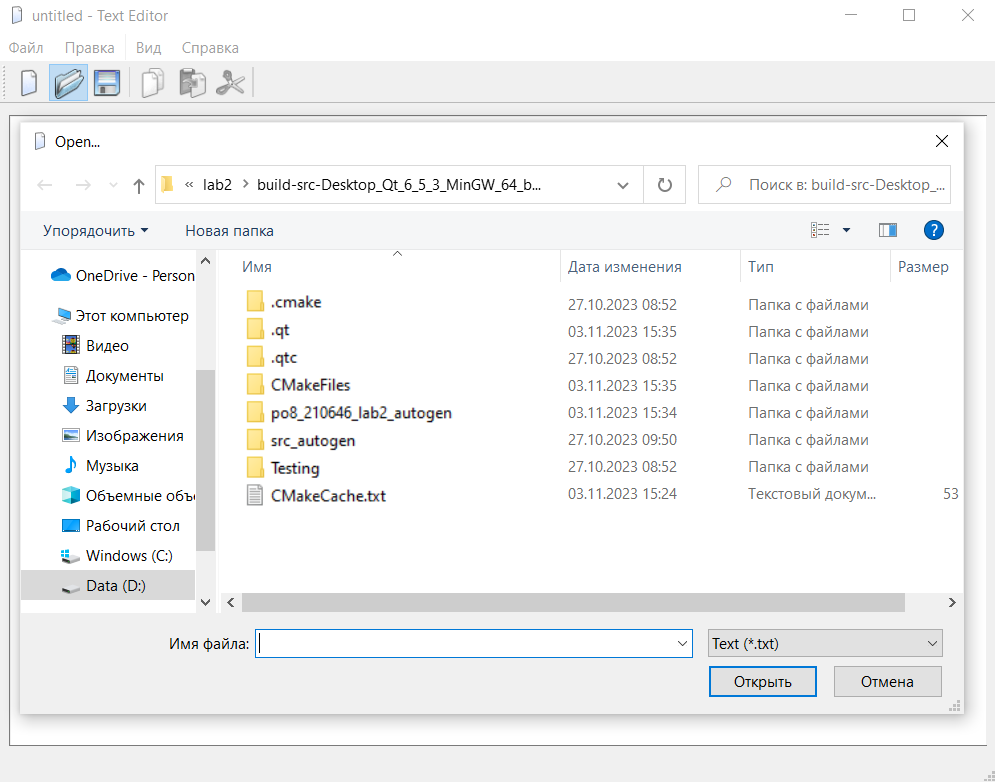
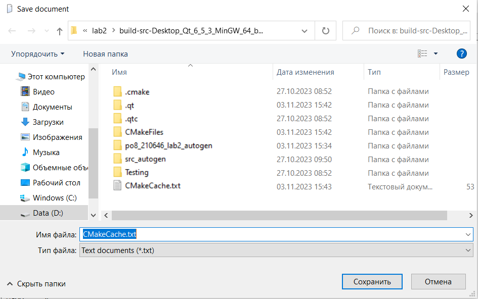
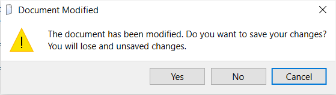

# Отчёт по лабораторной работе №2

`Сорока Вадим Сергеевич (ПО-8)`

## Основы Qt

## Цель лабораторной работы

Изучить структуру приложения на Qt, получить опыт использования стандартной документации Qt

## Начальное приложение

Для создание заготовки приложения используйте шаблон Qt Application. Создайте такой
проект и выберите только модули QtCore и QtGui. В качестве базового класса для класса главного окна выберите QTextEditor. Далее будем называть этот проект «TextEditor».

## Демонстрация работы

* Общий вид программы

* Открытие файла

* Открытый файл

* Сохранение

* Предупреждение о закрытии изменённого файла

