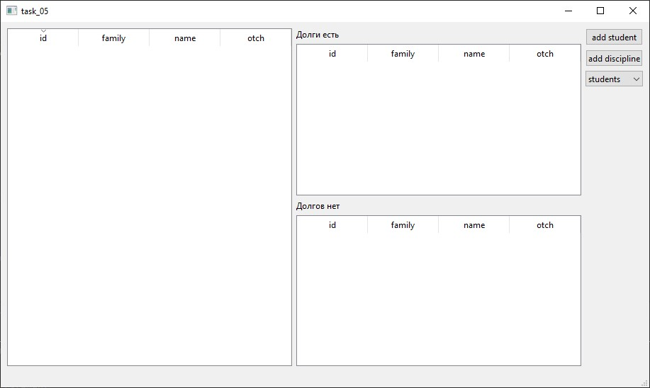
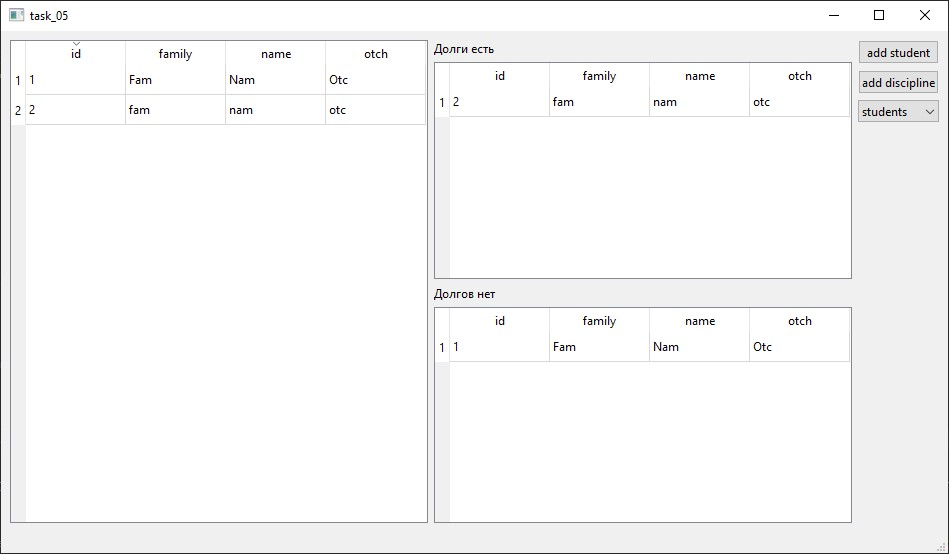

# Лабораторная работа № 5 #
# Создание приложений баз данных #
# Цель работы #
Отработка умений и навыков создания интерфейса баз данных.
# Вариант 4 #
Напишите программу «Учет успеваемости». В программе использовать три таблицы: student (поля id, family, name, otch), session (поля diss, vid) и result (поля id, itog). Создать запросы: создать список успешно сдавших сессию, создать список задолжников.
# Демонстрация работы приложения #
Изначальная таблица

Добавляю 2 студентов, они добавляются в таблицы успеваемости.

