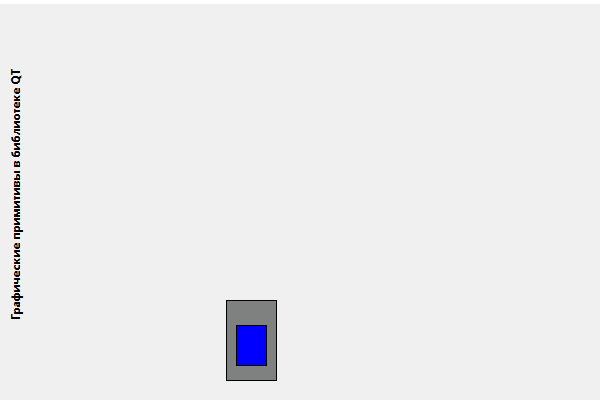

# Лабораторная работа №7
## Графические примитивы в библиотеке QT
## Цель лабораторной работы 
Изучить графические примитивы библиотеки QT.

## Вариант 4
|4|Полужирный|Прямоугольник, поставленный на пьедестал|Закручивающаяся спираль|

1. Вывести заданным шрифтом вертикально на экран наименование лабораторной
работы – **2 балла**.
2. Нарисовать цветную фигуру (**2 балла**) и организовать движение её по заданной
траектории (**6 баллов**).

## Демонстрация работы приложения

