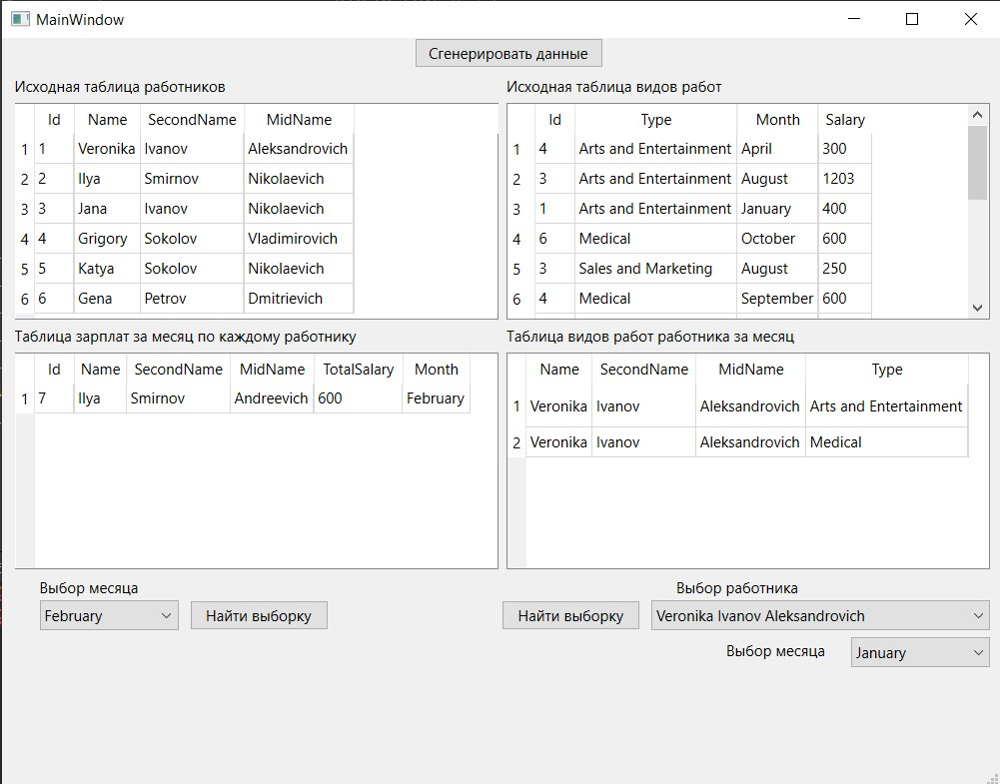

# Отчет по лабораторной работе № 5

## Создание приложений баз данных

## Вариант № 5

Напишите программу «Учет выплаты заработной платы». В программе использовать
две таблицы: fio (поля id, family, name, otch) и vid
(поля id, vid, month, summa). Создать запросы: вывод зар.
платы за месяц по каждому работнику; вывод вида работ работника за месяц.

## Код программы

* [main.cpp](./src/main.cpp)
* [mainwindow.cpp](./src/mainwindow.cpp)
* [mainwindow.h](./src/mainwindow.h)

А также файл формы

* [mainwindow.ui](./src/mainwindow.ui)

## Пример работы программы

