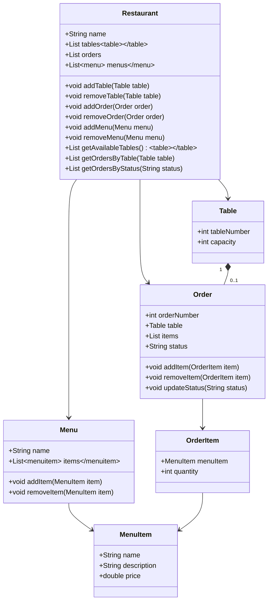

# Лабораторная работа № 6 #

## Тема ##

Изучение UML. Диаграмма классов.

## Цель работы ##

Освоить построение диаграммы классов.

## Порядок выполнения ##

1. Изучить теоретический материал из [документации](https://mermaid.js.org/intro/getting-started.html).
2. Выбрать свой вариант.
3. Нарисовать каждый класс отдельно с методами и полями.
4. Оформить отчет.

## Вариант 5 ##

- Постройте UML диаграмму классов для системы управления заказами в ресторане.

## Диаграмма ##

## Код ##

- [main.cpp](./src/main.cpp)

### Вывод ###

Освоил построение диаграммы классов.
