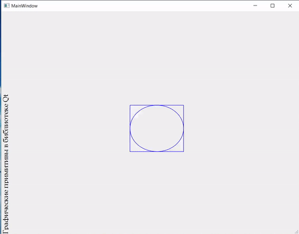

# Отчет по лабораторной работе №7

## Графические примитивы в библиотеке QT

## Вариант №5

1. Вывести заданным шрифтом вертикально на экран наименование лабораторной
работы – 2 балла.  
2. Нарисовать цветную фигуру (2 балла) и организовать движение её по заданной траектории
(6 баллов).

|№ варианта|Шрифт|Фигура|Траектория движения|
| :-: | :-: | :-: | :-: |
|5|Книжная гарнитура|Окружность на поставленном прямоугольнике|Синусоида y(x) = asin(x + b)|

## Код программы

- [MainWindow.h](./src/mainwindow.h)
- [MainWindow.cpp](./src/mainwindow.cpp)

Остальные файлы проекта вспомогательные.

## Пример работы программы

