# Отчет по лабораторной работе №3

## Контейнеры.

## Вариант №9

`Кухарев Дмитрий Николаевич (ПО-9)`

## Цель работы 

Отработка умений и навыков работы с контейнерами в различных видах приложений.

## Задания 

## Задание 1 Вектор 

Создайте консольное приложение vector. Подключите все
необходимые классы и заполните векторы пятью способами. Сохраните
изменения и запустите приложение на выполнение.
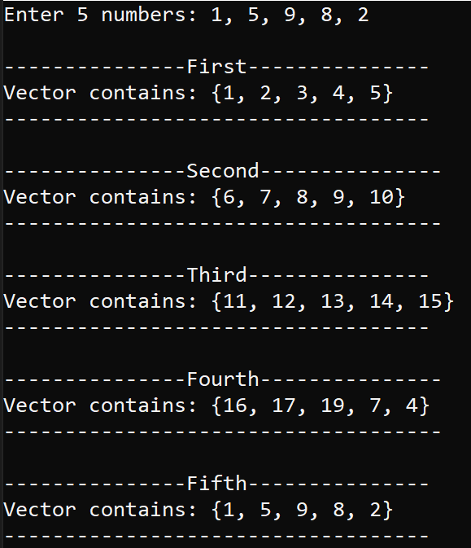
Код программы находится в [VectorTask1.cpp](./src/Task1/VectorTask1.cpp).

## Задание 2 Вектор

Создайте консольное приложение vect_sum, которое позволит
находить сумму элементов вектора, а также продемонстрирует применение
методов replace() и size().

Код программы находится в [VectorTask2.cpp](./src/Task2/VectorTask2.cpp).

### и так далее...

## Задание 1

Вариант 9

Реализовать приложение с графическим интерфейсом пользователя. Перераспределить значения переменных X и Y (переменные
вводятся в TextBox ) так, чтобы в X оказалось меньшее из этих значений, а в Y − большее.
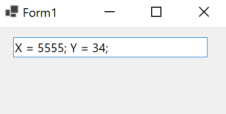
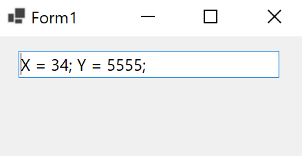
Код программы находится в [Form1.cs](./src/varTask1/Form1.cs).

## Задание 2

Реализовать для одномерных массивов консольный вариант приложения, для двумерных – с графическим интерфейсом. В консольном приложении значения
элементов массива вводятся пользователем, в графическом – задаются произвольно. 
Вариантов всего 5, так что 9 % 5 = 4;

Вариант 4
* 1. Дан целочисленный массив размера N. Преобразовать его, прибавив к
четным числам первый элемент. Первый и последний элементы массива не
изменять.

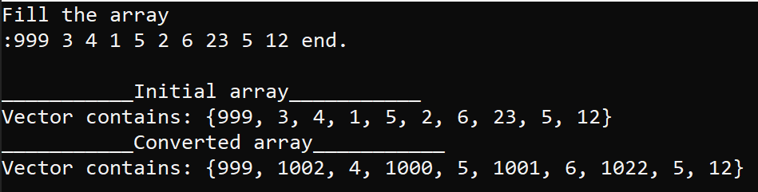
Код программы находится в [ConsoleApplication1.cpp](./src/varTask2/Console1/ConsoleApplication1.cpp).

* 2. Дана матрица размера m x n. В каждой строке найти количество элементов, больших среднего арифметического всех элементов этой строки.
С помощью ToolTip выводится среднее арифметическое элементов в строке и количество элементов по заданию.

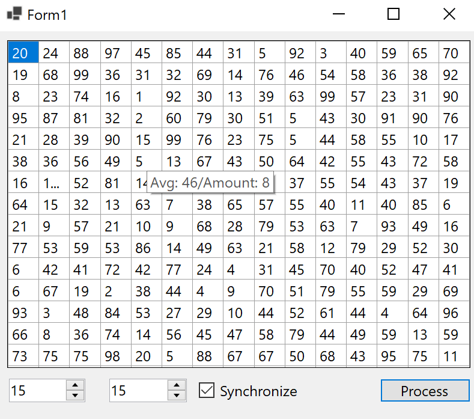
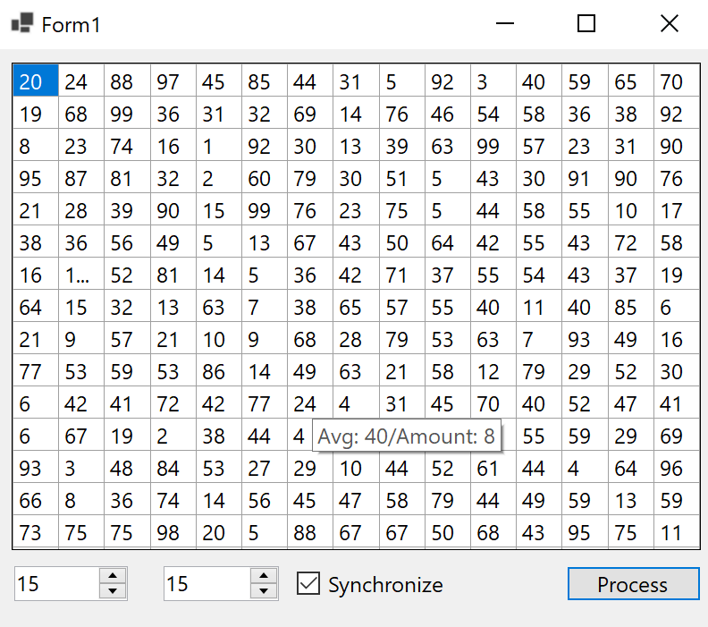
Код программы находится в [Form1.cs](./src/varTask2/GUI2/Form1.cs).

## Задание 3

Для работы со связным списком реализовать консольное приложение, со списком – использовать консольный(графический) интерфейс. Перебор элементов
осуществлять с помощью итераторов.

Вариант 4 (9 % 5 = 4)

* 1. Заполнить список случайными элементами и реализовать удаление
элементов с позиций с N по K.

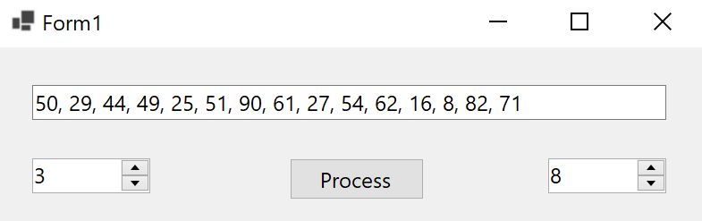
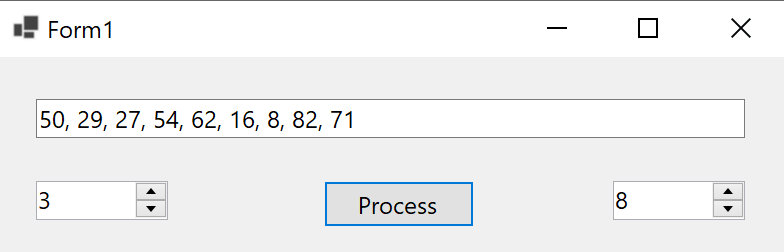
Код программы находится в [Form1.cs](./src/Task3_1/Form1.cs).
* 2. Заполнить связный список случайными элементами и отсортировать их по
убыванию.

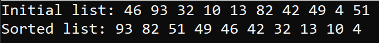
Код программы находится в [lr3t3c.cpp](./src/Task3_2/lr3t3c.cpp).

## Задание 4

Вариант 4 (9 % 5 = 4)

Реализовать приложения с графическим пользовательским интерфейсом. 
* 1. Сформировать стек из 8 чисел. Заменить значение первого элемента стека
произведением первого и последнего, значение второго элемента стека −
произведением второго и предпоследнего и т.д.

* 2. Заполнить очередь 8 случайными числами из интервала \[-20; 50\]. Найти среднее арифметическое значений двух соседних элементов
очереди. Результат поместить в очередь.

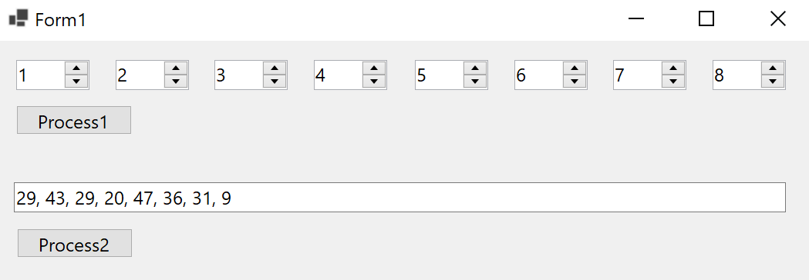
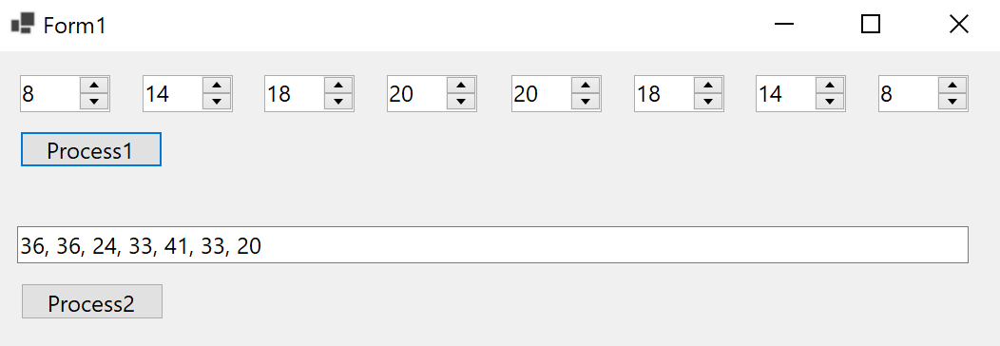
Код программы находится в [Form1.cs](./src/Task4/Form1.cs).

## Задание 5

Вариант 4 (9 % 5 = 4)

Реализовать приложения с графическим пользовательским интерфейсом.

Известны марки машин, изготовляемых в данной стране и
импортируемых за рубеж. Даны некоторые N стран. Определить для каждой
из марок, какие из них были доставлены во все страны, доставлены в
некоторые из стран, не доставлены ни в одну страну.

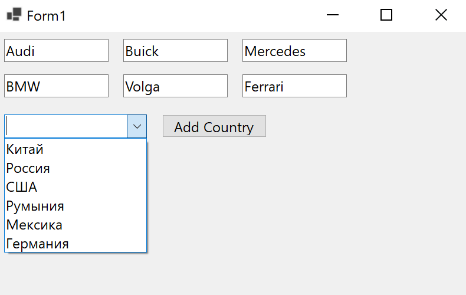
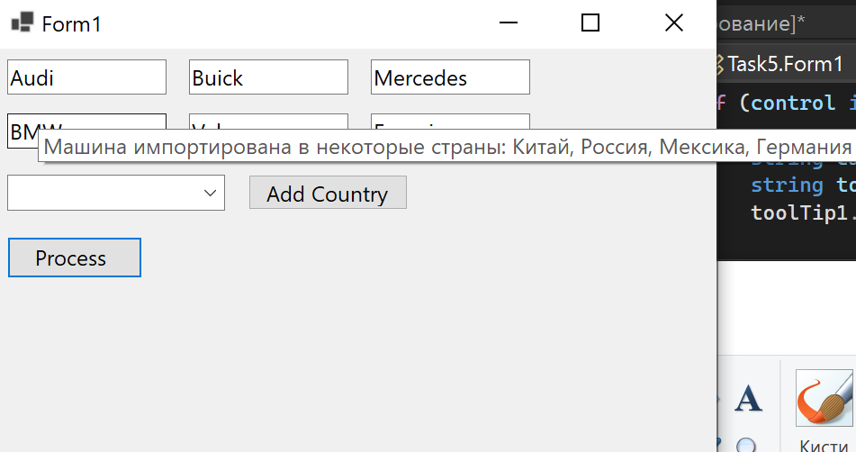
Код программы находится в [Form1.cs](./src/Task5/Form1.cs).

## Задание 6

Вариант 4 (9 % 5 = 4)

Реализовать приложения с графическим пользовательским интерфейсом.

Дан файл f, компоненты которого являются целыми числами.
Получите в файле g все компоненты файла f: 
* а) являющиеся чётными
числами; 

* б) делящиеся на 3 и не делящиеся на 7; 

* в) являющиеся точными
квадратами.

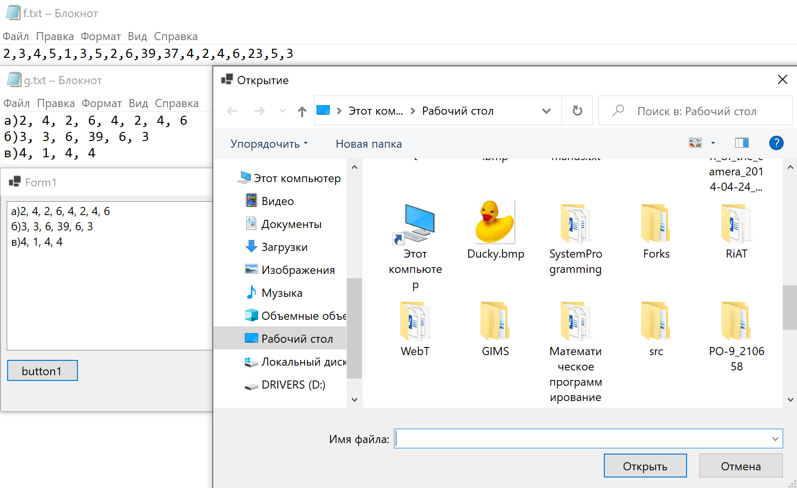
Код программы находится в [Form1.cs](./src/Task6/Form1.cs).

## Вывод

Отработали умения и навыки работы с контейнерами в различных видах приложений.
