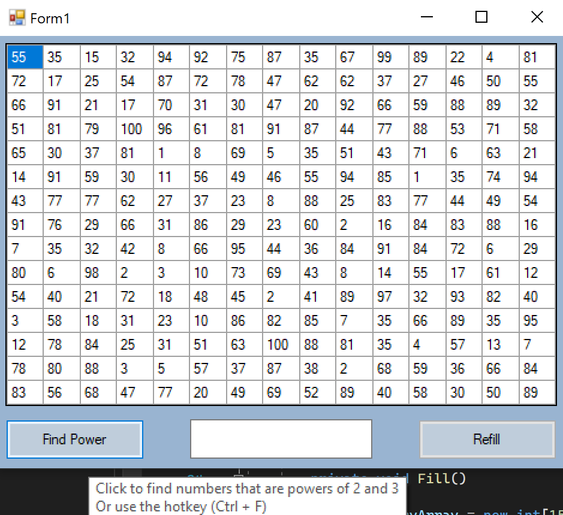
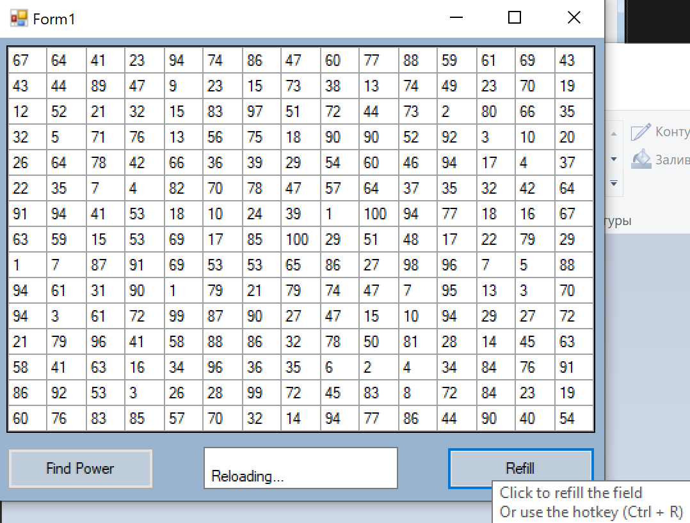

# Отчет по лабораторной работе №4

## Создание интерфейса простых приложений.

## Вариант №9

`Кухарев Дмитрий Николаевич (ПО-9)`

## Цель работы

Отработка умений и навыков описания событий в приложениях.

## Задание 

* 1.Напишите программу, которая находит в массиве 15х15 числа являющиеся степенью 2 и 3. Создайте интерфейс программы: в таблице 15х15 числа получить случайным образом; создать кнопки выполняемых действий; результат действий подсвечивать цветом; в поле надписи выводить количество найденных чисел.

*2.Добавить созданному приложению новую функциональность на основе событий. Создать события обработки «горячих клавиш» дублирующих функции кнопок, а при наведении курсора мыши на ячейку таблицы в компоненте ToolTip должно отображаться ее текущее значение.

## Результат выполнения

## Код программы

Код программы находится в [Form1.cs](./src/Form1.cs).

Остальные файлы созданы с помощью WinForms

## Вывод

Отработали умения и навыки описания событий в приложениях.
