# Отчет по лабораторной работе №5

## Создание приложений баз данных.

## Вариант №9

`Кухарев Дмитрий Николаевич (ПО-9)`

## Цель работы

тработка умений и навыков создания интерфейса баз данных.

## Задание 
С помощью программы SQLiteManager создать необходимые таблицы в файле базы данных. Наполнение таблиц осуществлять из созданной программы.

Напишите программу «Учет работы компьютеров в сети». В программе использовать
две таблицы: hosts (поля id, name, host) и users (поля id, user, hour). Создать запросы: 
* определить время работы компьютера в сети; 
* вывести список пользователей заданного компьютера; 
* указать пользователя работавшего за компьютером в указанное время.
Для возможности выполнения всех запросов создадим дополнительную таблицу users_time.
## Результат выполнения
hosts
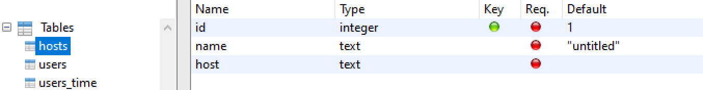
users
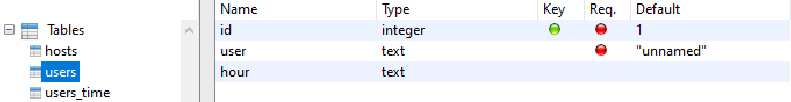
users_time
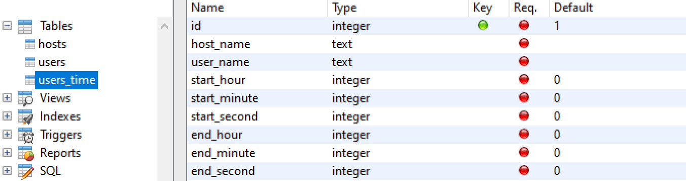
Вход
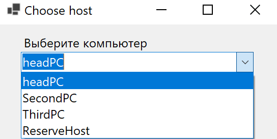
Ввойдем как пользователь
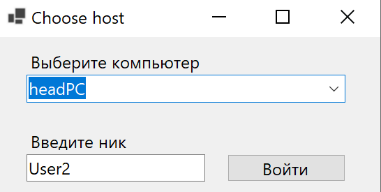
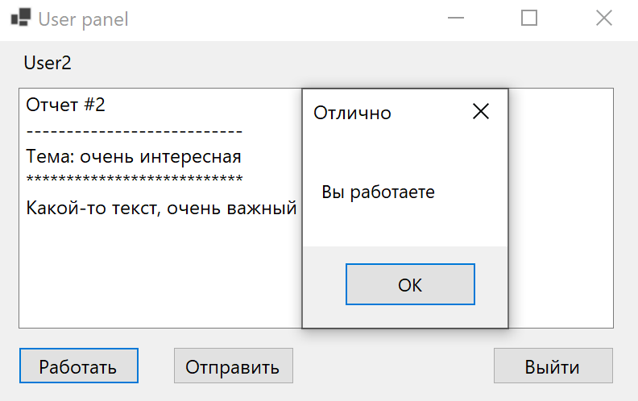
Теперь заходим как администратор
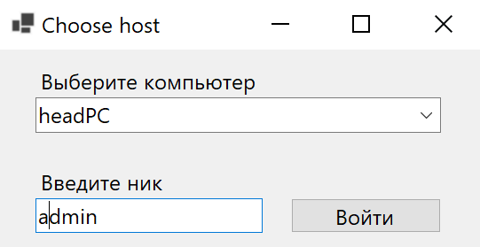
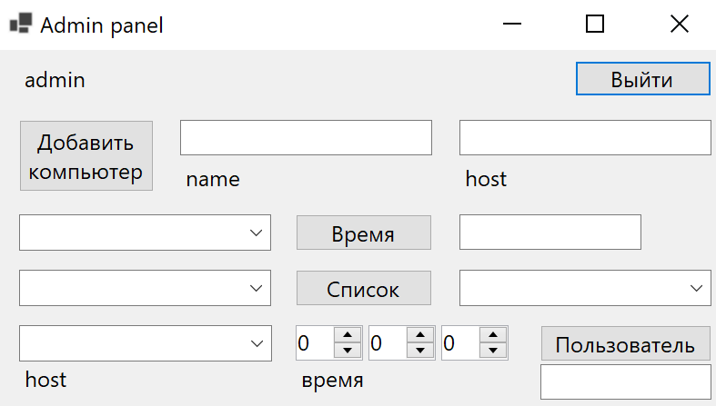
Можем добавить новый компьютер
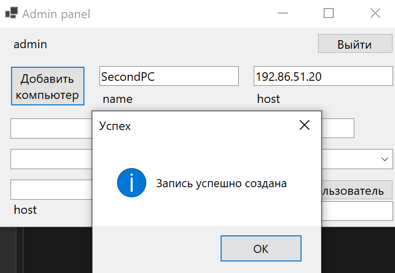
Определим суммарное время работы всех пользователей на выбранном компьютере
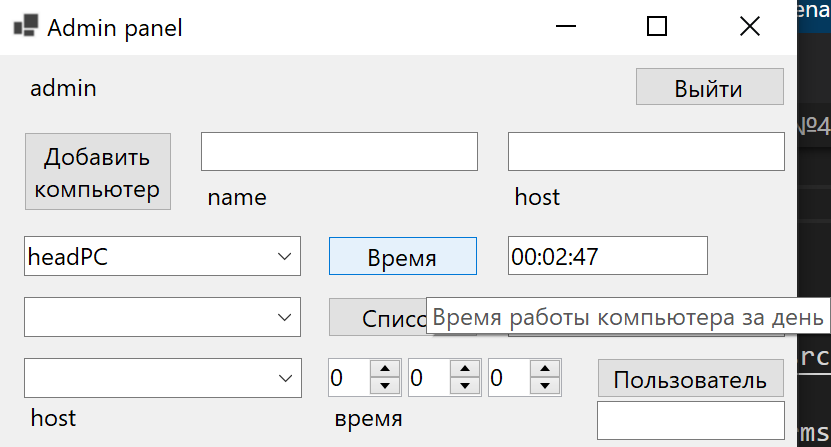
Выведем список всех пользователей для данного компьютера
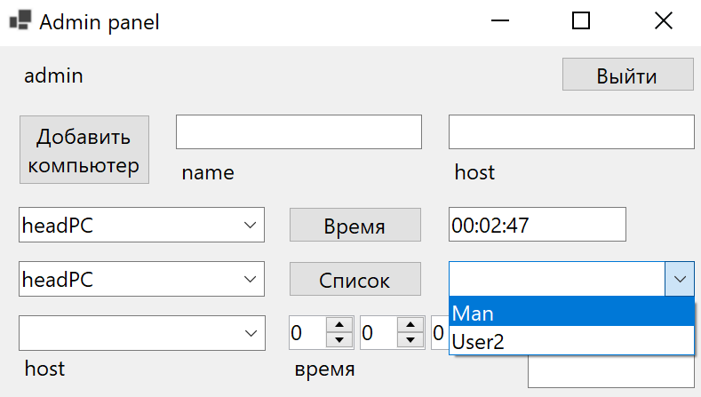
Найдем пользователя работавшего за данным компьютером в указанное время
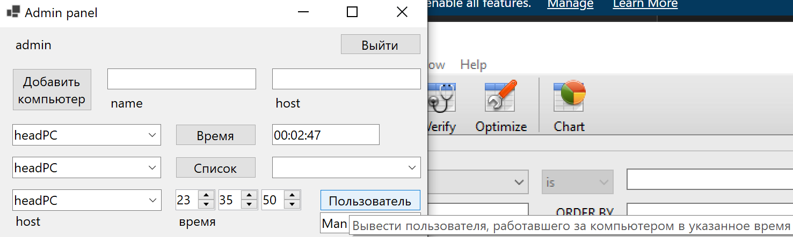

## Код программы

Код меню входа находится в [Form1.cs](./src/Form1.cs).

Код панели пользователя находится в [Form2.cs](./src/Form2.cs).

Код панели администратора находится в [Form3.cs](./src/Form3.cs).

Остальные файлы созданы с помощью WinForms

## Вывод

Отработали умения и навыки создания интерфейса баз данных.

