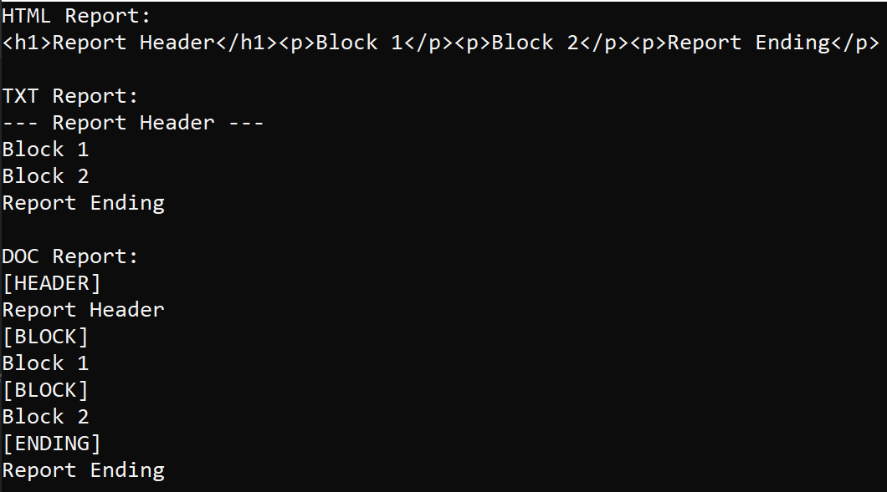
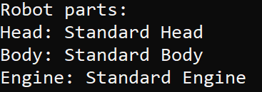
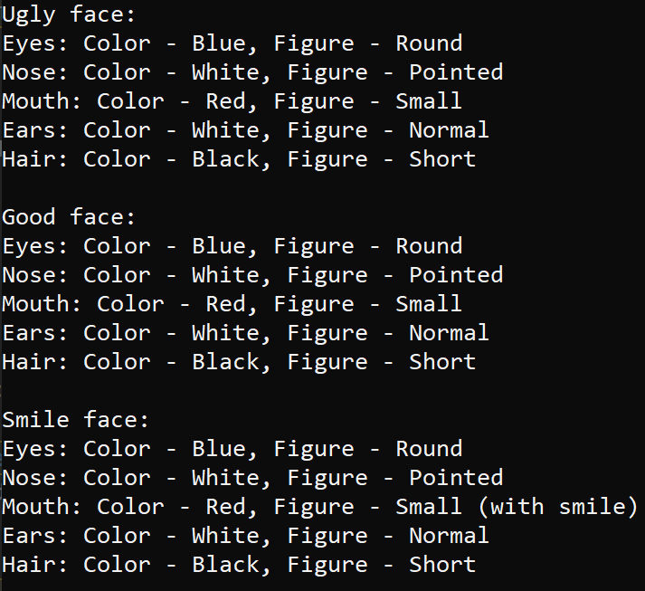

# Отчет по лабораторной работе №8

## Паттерны проектированя.

## Вариант №9

`Кухарев Дмитрий Николаевич (ПО-9)`

## Цель работы

Изучить паттерны проектирования.

## Задание 

Выполним вариант 4 (9 % 5 = 4):

Применить паттерн “Строитель” для построения: 

#### 1. Отчета по частям
* Части: Header – Заголовок, Block – Блок содержащий данные по отчету (результат SQL запроса), Ending – Концевик
* ConcreteBuilder: HtmlBuilder, TxtBuilder, XlsBuilder, DocBuilder

Код программы находится в [Report.cs](./src/Report/Program.cs).

#### 2. Представления робота в игровой программе
* Части: Head, Body, Engine
* ConcreteBuilder выбрать самостоятельно

Код программы находится в [Robot.cs](./src/Robot/Program.cs).

#### 3. Представления лица героя в ролевой игровой программе
* Части: Eyes - параметры (Color, Figure), Nose (Color , Figure), Mouth (Color, Figure), Ears (Color, Figure), Hair (Color, Figure)
* ConcreteBuilder: UglyFaceBuilder, GoodFaceBuilder, SmileFaceBuilder

Код программы находится в [Face.cs](./src/Face/Program.cs).

## Вывод

Изучили паттерны проектирования.

