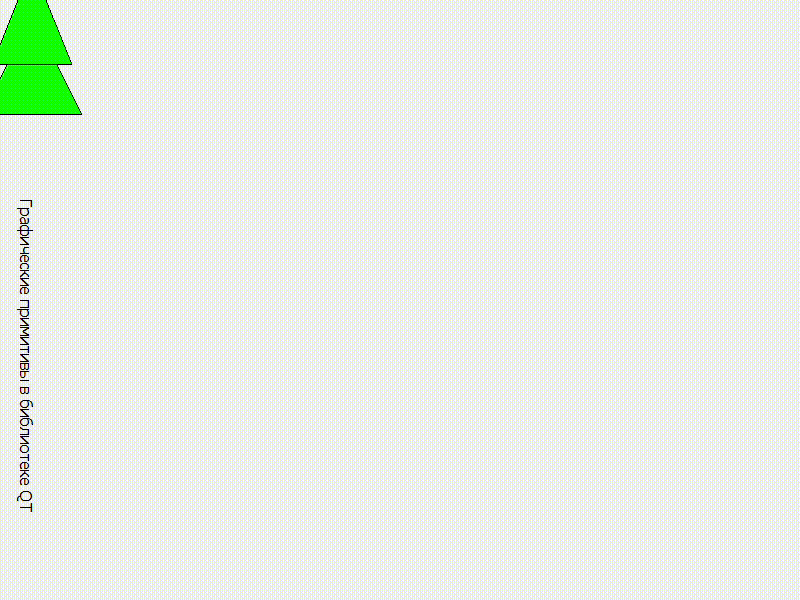

# Лабораторная работа №7

## Графические примитивы в библиотеке QT

## Вариант 14

## Цель лабораторной работы

Изучить графические примитивы библиотеки QT

- Вывести заданным шрифтом вертикально на экран наименование лабораторной работы.

- Нарисовать цветную фигуру и организовать движение её по заданной траектории.

|№ варианта|Шрифт|Фигура|Траектория движения|
| :-: | :-: | :-: | :-: |
|14|Готический|Ёлка из двух треугольников|Верзьера Аньези $$y = {8a^3 \over x^2 + 4a^2} (a < 0)$$|

## Ход работы

- Вывести шрифтом "Готический" вертикально на экран надпись "Графические примитивы в библиотеке QT".

- Нарисовал фигуру (Ёлка из двух треугольников) зеленым цветом

- Реализовал движение по траектории Варзьера Аньези

## Демонстрация работы приложения

Результатом работы программы является:

## Вывод

Я изучил графические примитивы библиотеки QT.
