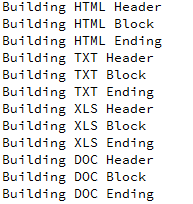
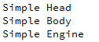
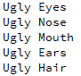

# Лабораторная работа №8

## Паттерны проектирования

## Вариант 19

## Цель лабораторной работы

Изучить паттерны проектирования в С++.

## Задание №4 (19 % 5 = 4)

№4. Применить паттерн “Строитель” для построения

    - Отчета по частям
      - Части: Header – Заголовок, Block – Блок содержащий данные по отчету (результат SQL запроса), Ending – Концевик
      - ConcreteBuilder: HtmlBuilder, TxtBuilder, XlsBuilder, DocBuilder
    - Представления робота в игровой программе
      - Части: Head, Body, Engine
      - ConcreteBuilder выбрать самостоятельно
    - Представления лица героя в ролевой игровой программе
      - Части: Eyes  - параметры (Color, Figure), Nose (Color , Figure), Mouth (Color, Figure), Ears (Color, Figure), Hair (Color, Figure)
      - ConcreteBuilder: UglyFaceBuilder, GoodFaceBuilder, SmileFaceBuilder

## Демонстрация работы приложения

Результатом работы программы является:

- Отчет по частям

- Представления робота в игровой программе

- Представления лица героя в ролевой игровой программе

## Вывод

Я изучил паттерны проектирования в с++.
