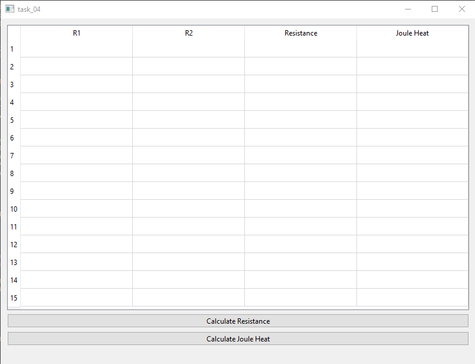
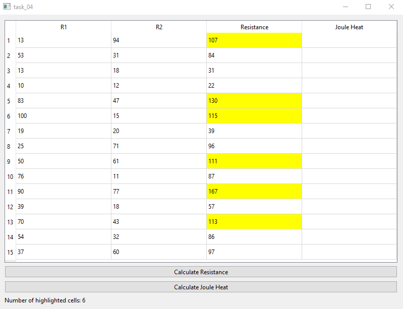

# Отчет по лабораторной работе №4

## Создание интерфейса простых приложений

## Вариант 10
Напишите программу, которая рассчитывает 15 значений сопротивления по закону Ома и количество выделенного тепла по закону Джоуля-Ленца за время 10 сек. Создайте интерфейс программы: в таблице 4х15 в первых двух полях числа получить случайным образом (от 10 до 100); создать кнопки расчета сопротивления и выделенной энергии; результат выводить во третье и четвертое поля таблицы; в результате подсвечивать цветом значения сопротивления в интервале от 100 Ом до 1 кОм и энергии от 10 до 100 Дж; в поле надписи выводить количество таких значений.
## Реализация/ход работы

При запуске программы видим следующее.

При нажатии на кнопку расчёт сопротивления происходит перегенетрация таблицы:

При нажатии на кнопку расчёт Джоуля-Ленца:

