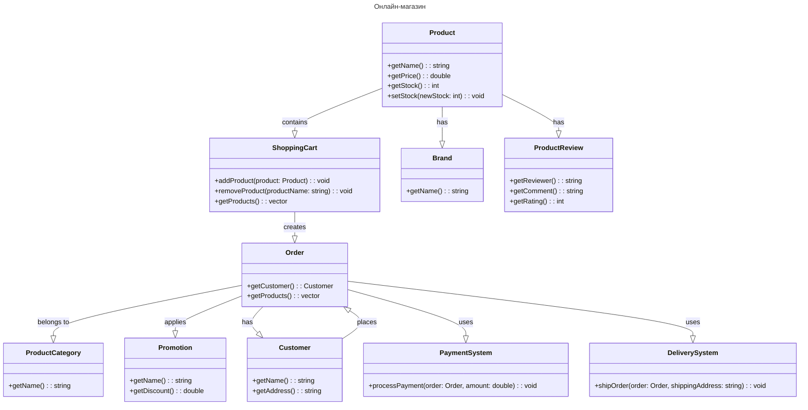

# Лабораторная работа № 6

## UML - диаграммы

## Цель работы

Изучить UML-диаграммы, применить их на практике.

## Задания для выполнения (Вариант 22)

Постройте UML диаграмму классов для онлайн-магазина, который продает электронику.

## Вывод

Изучили UML-диаграммы и применили их на практике.
