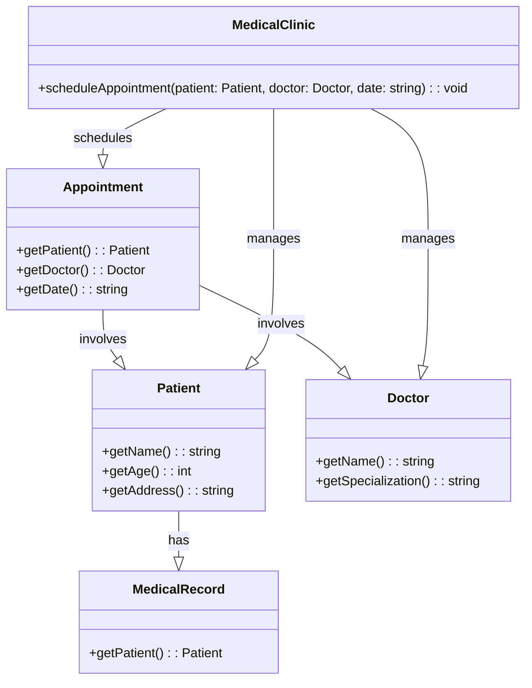

# Лабораторная работа №6

## Изучение UML. Диаграмма классов

## Вариант 23

## Цель лабораторной работы

Освоить построение диаграммы классов.

## Задание

Постройте UML диаграмму классов для системы управления медицинской клиникой.

## Ход работы

